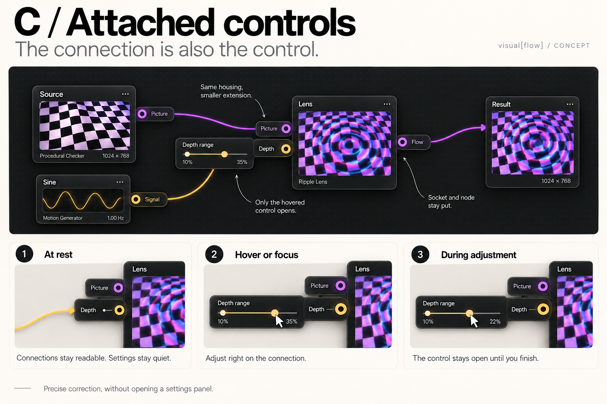

# C / Attached controls

Concept revision based on Ryan's feedback: combine A's breakout connections with B's quiet compact presentation. Breakouts share the node's materials and shape. Adjustments live inline on each breakout and appear on hover or keyboard focus. Active dragging keeps the control open. Node and connection anchors should remain fixed. For touch, a tap can reveal the same control.

The image is an illustrative static mockup, generated with the built-in image-generation tool. Range editing is proposed interaction design, not a claim about an existing range widget. Cable anchoring and pointer transition between socket and control need verification in a future prototype.

## Generation prompt

Use case: ui-mockup. Create a substantially refined new single landscape 3:2 UX design proposal board using the attached prior Breakout concept as a reference, not as a fixed layout. High resolution, impeccable legible typography. Title "C / Attached controls". Subtitle "The connection is also the control." Small subtle "visual[flow] / CONCEPT".
User direction: combine the physical breakout connections of A with the quiet compact visual language of B. The actual numeric adjustment is ON the breakout itself, not a separate popover. Breakouts should feel visually and materially unified with the node they belong to, almost extensions or small articulated tabs of the same housing. At rest compact, understated. Hover reveals inline settings on only that breakout, not the whole node. Keyboard focus also reveals it, pointer drag holds it open. This is conceptual interaction design, not existing software.
Art direction: premium restrained instrument UI, graphite charcoal housings, same radius and fine border on node and attached controls; warm ivory editorial sheet, oversized confident black typography, magenta/cyan checker ripple previews, subtle amber for numeric modulation and violet for image wires. Avoid neon glowing pill islands, detached popup panels, glossy gaming UI, clutter, paragraph blocks. Graph connections can curve, but the node and control share an obviously designed coherent physical language. No decorative slogans.
Composition: wide hero across upper middle taking 55 percent of sheet, bottom row THREE detailed interaction closeups. Main hero two compact preview-led Source and Lens nodes with a small Sine below Source. Source picture wire violet goes to Lens Picture INPUT on LEFT edge, Sine Signal output amber goes to Lens Depth INPUT on LEFT edge. Lens output Flow jack on RIGHT edge leads to finished result picture viewport, same checker ripple as Lens. Lens housing is dark compact rectangle. Its left Picture and Depth breakouts are slightly extruded attached tabs connected to its chassis by very short stems, same fill/border/radius, generous readable labels. At-rest Depth tab shows only amber socket, label "Depth", and a thin subtle range mark. No slider everywhere. A single hovered Depth breakout in hero can extend left into a horizontal control wing integral to housing, with readable label "Depth range", one inline dual-end range track, and end values "10%" and "35%". Its amber incoming cable attaches to the stable outer socket and does not get pushed around by hover. The control's wing expands in a reserved space next to the fixed connection anchor, not moving socket or node. No detached popup.
Editorial callouts: "Same housing, smaller extension"; "Only the hovered control opens"; "Socket and node stay put".
Bottom three closeups large and crisp, same Lens Depth breakout shown in three states:
1 "At rest": compact attached dark tab "Depth", amber socket and slim quiet range indicator. Caption "Connections stay readable. Settings stay quiet."
2 "Hover or focus": same tab, expanded inline horizontal range track in joined control wing labeled "Depth range", values "10%" and "35%", pointer over upper handle. Caption "Adjust right on the connection."
3 "During adjustment": same geometry, pointer dragging upper handle from 35% to 22%, displayed range "10%" to "22%". Caption "The control stays open until you finish."
Footer single sentence: "Precise correction, without opening a settings panel."
Important interaction integrity: connected numeric control adjusts modulation range, does not misleadingly replace a source signal slider. Source picture and Sine numeric go to LEFT input sockets; outgoing Flow at RIGHT. Main Source checker output only Picture, no invented numeric or point outputs. Static UI mockup so views represent states, not a functioning animation. No permanent parameter lists, no global inspector, no new-node choice storyboards this time; focus on the attached control mechanics. Leave substantial whitespace and clear cable routes. Do not use the exact old A neon pill visual style. Make nodes and breakouts feel like one instrument.
