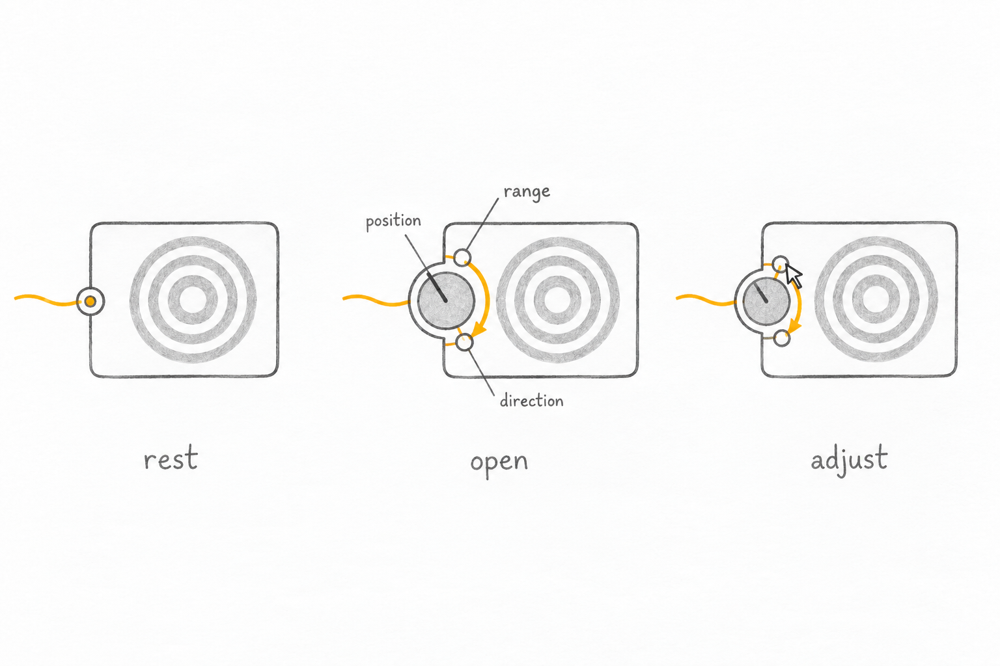
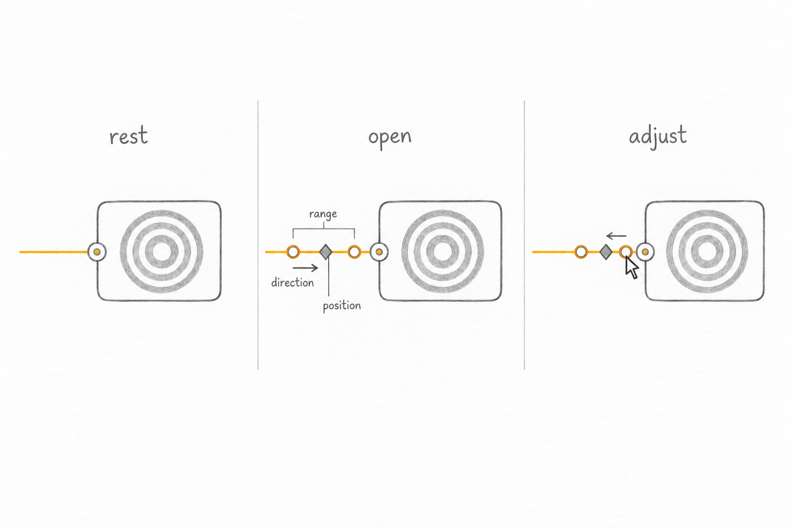
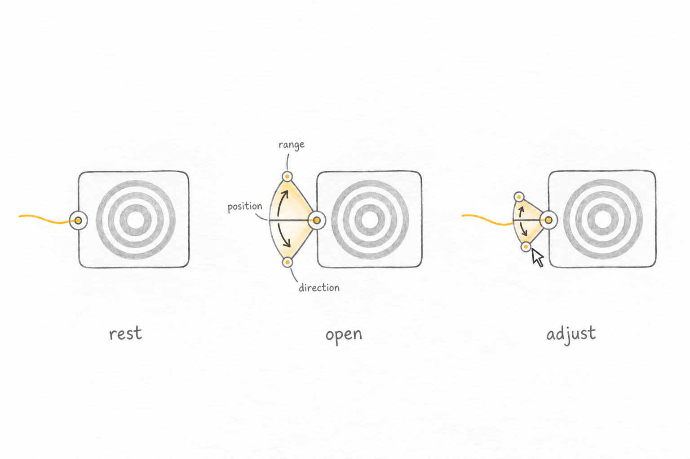
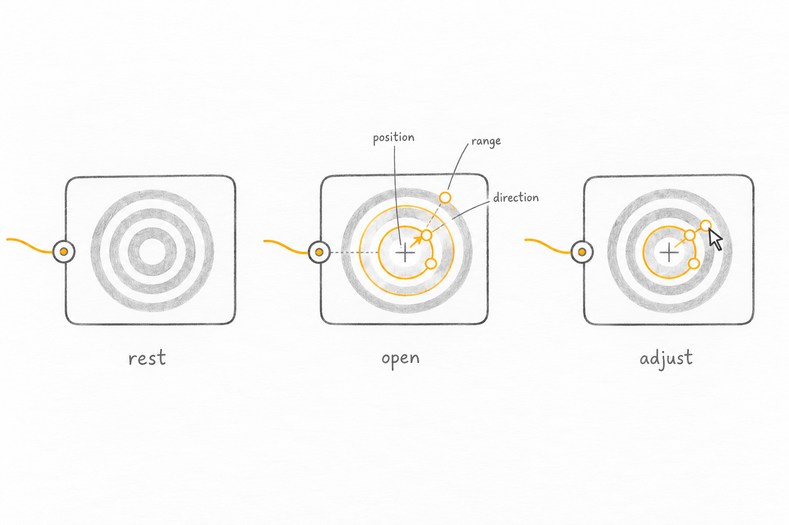
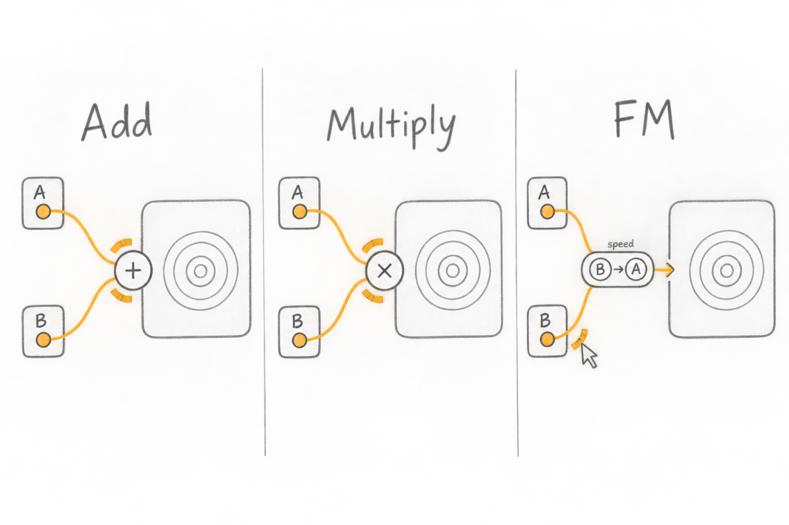
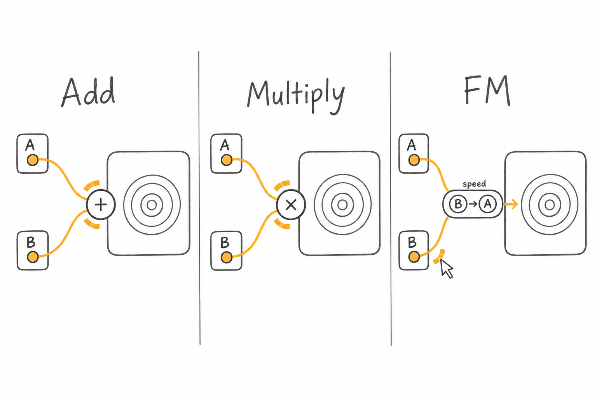

# Connector alternatives

Explorations only. Generated with built-in image_gen; exact prompts in manifest.json.

The dual knob makes the connector itself the control. The cable rail preserves the preview but competes with cable dragging. The fan exposes range spatially but needs room. Picture handles suit spatial parameters, not every scalar.

Sketch limitations: knob size shifts during adjustment; cable-rail arrow reverses; fan radius changes; picture overlay loses an outer boundary. These are concepts, not validated gestures.

Multiple-modulator proposal: Add combines values, Multiply combines strengths, FM lets B change A’s rate locally for this connection. Mutual feedback, ordering, and more than two sources remain unresolved. FM capsule still needs a more clearly joined outline.

## Expanding dual knob

## Cable range rail

## Socket fan

## Picture handles

## Multiple modulators — retained draft

## Multiple modulators

