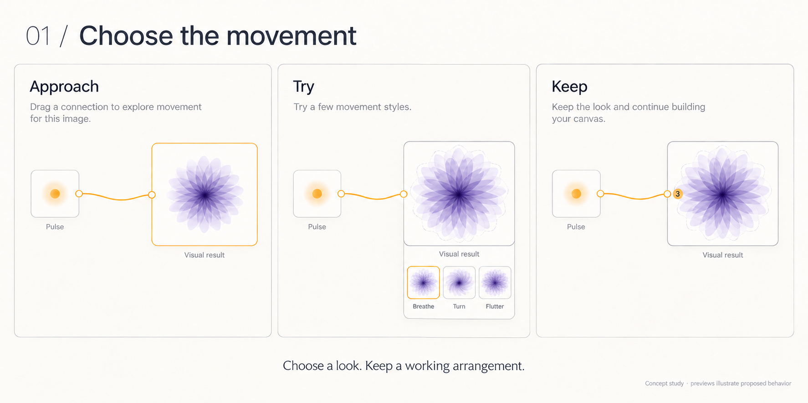
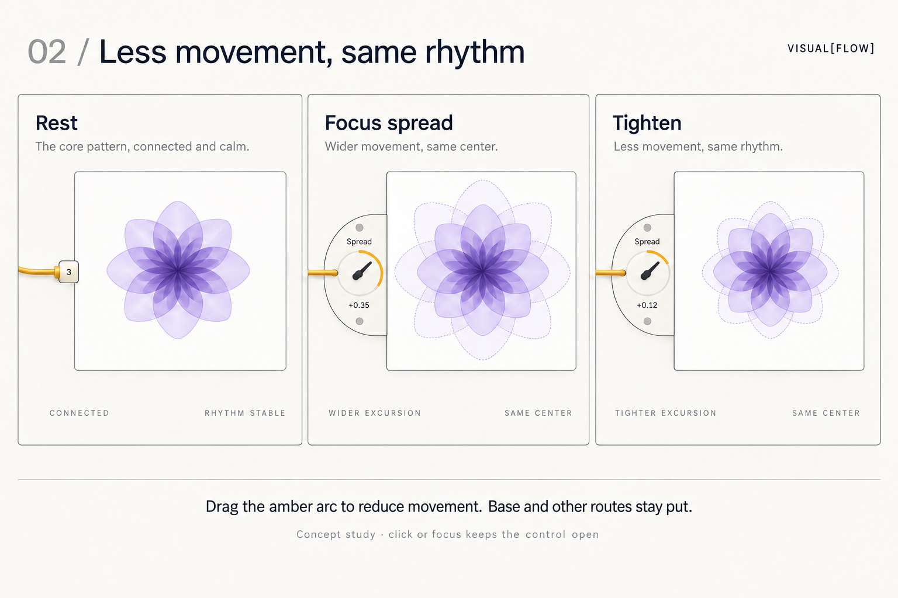
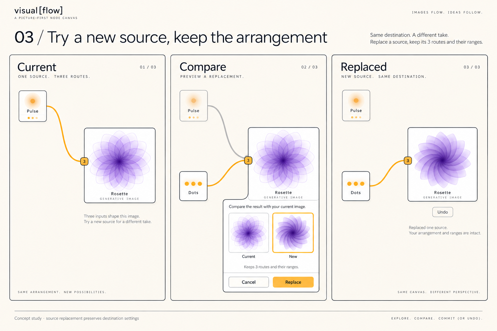

# Next-detail studies

Three proposed interactions, generated with built-in image_gen. Exact original and correction prompts are in [manifest.json](manifest.json). These are illustrations, not renderer captures or implemented behavior.

## Review of the previous studies

The strongest direction is a quiet picture with one attached, selectively expanding control. H-2 distinguishes untouched, connected and changed without exposing all settings. The dual-knob concept puts the correction at the connection, but its geometry changes during adjustment. Rosette becomes a permanent parameter strip; Ripple's mixing attachment competes with its picture. Array/Star is the strongest typed-routing example: coordinates remain coordinates, and only numeric variation receives depth control. Polar's shared clasp risks suggesting that separate values are mixed.

The new pass prioritizes usable visual decisions, one local correction, and reversible replacement. It deliberately leaves multiple-source arithmetic unresolved.

## 01 — Choose the movement

A temporary shelf attached below the target offers three visual arrangements. Selecting one supplies the configuration; the shelf closes and the result remains. A compact 3-route marker is all that remains of detailed routing.

Assessment: strongest overall direction. The choices are visually distinct and clearly attached to the result. Still images cannot establish that Breathe, Turn and Flutter communicate different motion; these must be animated previews. The shelf must not appear for every obvious connection. Exact acceptance/cancel gestures remain to prototype. The route-count badge is still a separate dot rather than a completely resolved joined connector.

## 02 — Less movement, same rhythm

Select one route, reduce its amber depth arc, preserve base and the other routes. Ghost contours communicate a smaller excursion. The correction pass shrinks the full-height wing into a local lobe.

Assessment: arc change and resulting excursion are legible, but this drawing DOES NOT solve the fixed-anchor requirement. Cable endpoint still moves outward when the lobe opens, and the preview width varies. Do not copy this geometry into implementation. A deterministic prototype must lock target bounds and cable anchor while growing the control around them. Values are illustrative; this is not a verified numeric mapping to the drawn rosette. Ghost contours belong to active adjustment only.

## 03 — Try a new source, keep the arrangement

Compare current and proposed outcomes in a target-attached shelf. Replace preserves destination routes and ranges; the old source remains on the canvas, disconnected. Undo returns to the prior arrangement.

Assessment: clearest account of preserving work. The shelf is too tall and text-heavy; the next prototype should reduce it to two live previews and one concise action row. The Dots source is a conceptual stand-in, not a verified engine node. The two cables during comparison need a stronger proposed-connection treatment to avoid suggesting a committed mix. Compatibility must be checked before promising all three routes survive.

## Proposed behavior to test

- Hover may reveal; click, keyboard focus or tap holds the control open. Escape cancels a pending preview or closes a detail view.
- A source replacement is one undoable operation. Cancel preserves the original routes and all values.
- A bundle never implies summation. Coordinate, picture and numeric routes retain their meanings.
- One useful arrangement can be accepted without entering detailed controls.
- Start prototyping board 01; use board 02 as the demanding geometry test and board 03 as the preservation test.

## Review record

Parent created and visually inspected three boards, then corrected source captions in 01 and reduced the attachment in 02. Native research agent /root/design_review independently reviewed the prior studies at the recorded immutable revision, inspecting six boards and the intent/READMEs. Review completed; no implementation or runtime work was assigned. Findings informed this pass. No app code, servers, slide-generation files, or existing studies were changed. No implementation tests were applicable.
